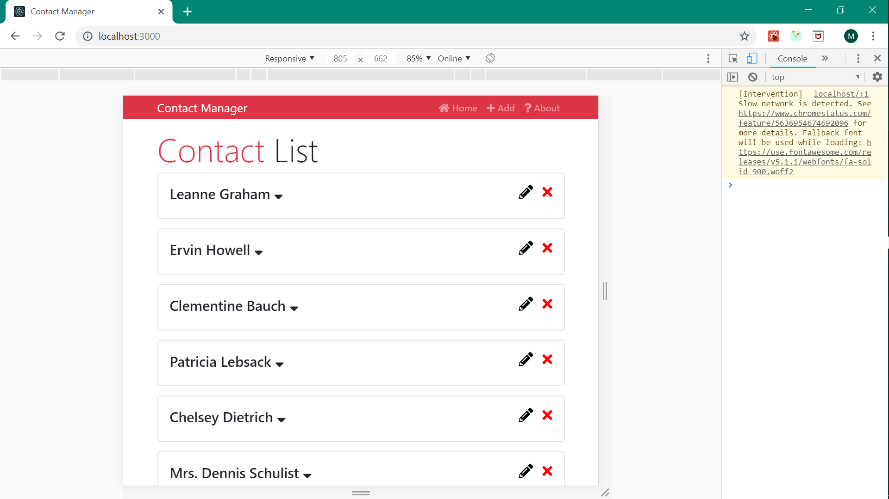
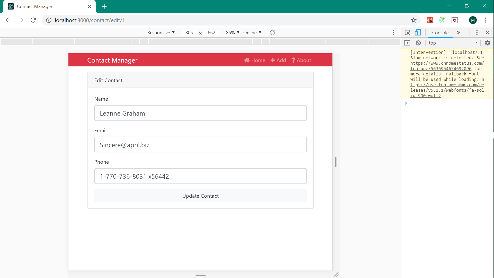
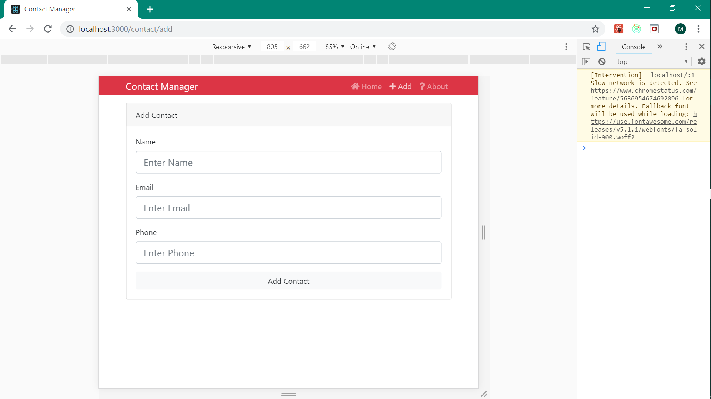
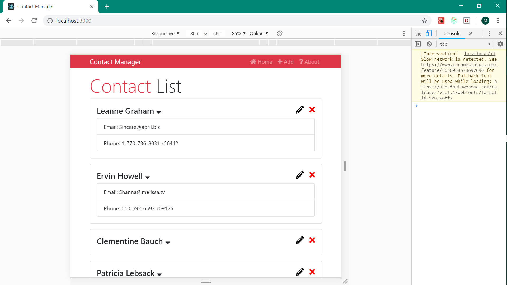
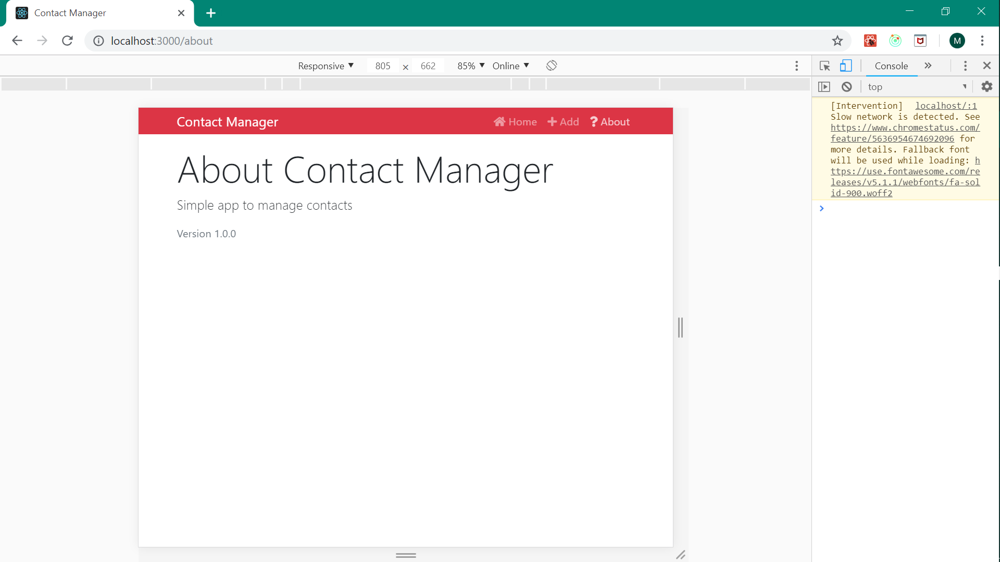

# Contact-Manager-React-Redux-Web-app-
contact manager where we can add/delete/edit contacts .
# Dependencies  
plz do command 'npm install' in downloaded directory to install npm packages
to run project do command 'npm start' in command prompt
# Screenshots

